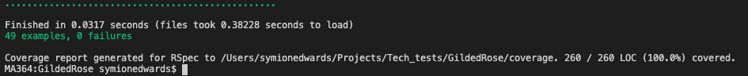

# Gilded Rose Tech Test 🥀
This is my submission for the Gilded Rose Tech Test, completed as part of Makers Academy's tech test week. I chose to write the code in Ruby, using RSPEC to TDD. My code has 100% test coverage according to the SimpleCov gem.

I started writing comprehensive feature tests for all of the different items. This allowed me to begin to refactor the code without having to worry that I was changing the functionality. I began by refactoring the update_quality method to become a switch statement. I then extracted several different classes for each of the different items.  
### Setup and Code Example:

Setup: Fork this repository

Clone the repository and follow below:

```
  > bundle install
  > rspec
```

### Specification
This is a well known kata developed by  [Terry Hughes](http://iamnotmyself.com/2011/02/13/refactor-this-the-gilded-rose-kata/). This is commonly used as a tech test to assess a candidate's ability to read, refactor and extend legacy code.

Here is the text of the kata:

*"Hi and welcome to team Gilded Rose. As you know, we are a small inn with a prime location in a prominent city run by a friendly innkeeper named Allison. We also buy and sell only the finest goods. Unfortunately, our goods are constantly degrading in quality as they approach their sell by date. We have a system in place that updates our inventory for us. It was developed by a no-nonsense type named Leeroy, who has moved on to new adventures. Your task is to add the new feature to our system so that we can begin selling a new category of items. First an introduction to our system:

All items have a SellIn value which denotes the number of days we have to sell the item. All items have a Quality value which denotes how valuable the item is. At the end of each day our system lowers both values for every item. Pretty simple, right? Well this is where it gets interesting:

-   Once the sell by date has passed, Quality degrades twice as fast
-   The Quality of an item is never negative
-   “Aged Brie” actually increases in Quality the older it gets
-   The Quality of an item is never more than 50
-   “Sulfuras”, being a legendary item, never has to be sold or decreases in Quality
-   “Backstage passes”, like aged brie, increases in Quality as it’s SellIn value approaches; Quality increases by 2 when there are 10 days or less and by 3 when there are 5 days or less but Quality drops to 0 after the concert

We have recently signed a supplier of conjured items. This requires an update to our system:

-   “Conjured” items degrade in Quality twice as fast as normal items

Feel free to make any changes to the UpdateQuality method and add any new code as long as everything still works correctly. However, do not alter the Item class or Items property as those belong to the goblin in the corner who will insta-rage and one-shot you as he doesn’t believe in shared code ownership (you can make the UpdateQuality method and Items property static if you like, we’ll cover for you)."*

## [](https://github.com/makersacademy/course/blob/master/individual_challenges/gilded_rose.md#the-brief)The brief:

Choose  [legacy code](https://github.com/emilybache/GildedRose-Refactoring-Kata)  (translated by Emily Bache) in the language of your choice. The aim is to practice good design in the language of your choice. Refactor the code in such a way that adding the new "conjured" functionality is easy.

HINT: Test first FTW!